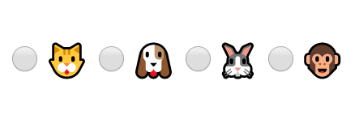

In this post, we are going to learn how to use **React Context** to create and provide a state and functionalities to a group of components.

## A Basic Radio Button Component

First, let's create a Component that we will call **RadioButton**, it will receive **checked**, **value**, **onChange** and **children** as a props. We want to encapsulate the **'input'** html tag into a react component to make it reusable.

```jsx
import React from 'react';

function RadioButton({ checked, value, onChange, children }) {
  return (
    <label>
      <input
        type="radio"
        value={value}
        checked={checked}
        onChange={({ target }) => onChange(target.value)}
      />
      {children}
    </label>
  );
}
```

This component works as a **presentation component**, this is not a thing officially, but many people like to give this name to components that do not have a local state and return jsx elements.

Now we can use this component to display a group of inputs of **type="radio"**, for example of animals.

```jsx
function Animals() {
  return (
    <div>
      <RadioButton>🐱</RadioButton>
      <RadioButton>🐶</RadioButton>
      <RadioButton>🐰</RadioButton>
      <RadioButton>🐵</RadioButton>
    </div>
  );
}
```



To select one of a group of options we need a state to hold the current value selected.
For example, if the selected value is **"cat"**, the state is **"cat"**, if change to **"monkey"** the state will be **"monkey"**.

## Handle the state of our component

Let's create a stateful component in which we want to know if users prefer a cat or a dog as a pet. I know, I know, this is a tough decision. 🤔

```jsx{numberLines: true}
/* highlight-range{2,4-6,14-16,22-24} */
function Form() {
  const [pet, setPet] = React.useState('cat');

  function handleOnChange(value) {
    setPet(value);
  }

  return (
    <div>
      <RadioButton value="cat" checked={'cat' === pet} onChange={onChange}>
        <span role="img" aria-label="cat">
          🐱
        </span>
      </RadioButton>
      <RadioButton value="dog" checked={'dog' === pet} onChange={onChange}>
        <span role="img" aria-label="dog">
          🐶
        </span>
      </RadioButton>
    </div>
  );
}
```

let's review what we did here.

First, we declared a stateful component called **Form**.

A **stateful component** is a component that can have one or more local states.

- at **line 2** we have used `React.useState` with an initial value `"cat"`.
- then at **line 4 to 6**, we declared a function `handleOnChange` that will update the state of the component.
- and finally at lines **14 to 16** and **22 to 24** we have passed the `cat` and `dog` emojis with their appropriated tags to the RadioButton component.

```jsx
<RadioButton value="dog" checked={'dog' === pet} onChange={handleOnChange}>
  <span role="img" aria-label="dog">
    🐶
  </span>
</RadioButton>
```


## Using context to share states through components

The logic behind a **radio button** is simple, it allows an user to choose only one of a group of options, in this case, an user only can choose between <span role="img" aria-label="cat">🐱</span> or <span role="img" aria-label="dog">🐶</span>.

We are going to use React Context to share the state through the Radio Button Components.

Let's create a context with `React.createContext()` and the return value will be assign to a const named `RadioContext`.

```jsx
const RadioContext = React.createContext();
```

We are going to change the name of the stateful component from **Form** to **RadioGroup** and now it will recieve three new props **defaultValue**, **onChange** and **children**.

```git
- function Form()
+ function RadioGroup({ children, defaultValue = "", onChange }){
  //...
}
```

We'll rename the old `pet` and `setPet` variable names to more generic ones like `state`, `setState` and this state will remain as an empty string.

```git
- const [pet, setPet] = React.useState("cat");
+ const [state, setState] = React.useState("");
```

Now that we are receiving a new prop **defaultValue** we need to add it to the state every time it changes so We'll use **React.useEffect** for this.

```jsx
React.useEffect(() => {
  setState(defaultValue);
}, [defaultValue]);
```

In the return statement, we will use `RadioContext.Provider` to allow other components to subscribe to the context changes, we will provide these values in `value={[state, onChange]}`

```jsx
<RadioContext.Provider value={[state, onChange]}>
  <div role="radiogroup">{children}</div>
</RadioContext.Provider>
```

Now let's move all of this to another file `radioButton.js`

```jsx
// radioButton.js
import React from 'react';
const RadioContext = React.createContext();

function RadioGroup({ children, defaultValue, onChange }) {
  const [state, setState] = React.useState('');

  function handleOnChange(value) {
    setState(value);
    onChange(value);
  }

  React.useEffect(() => {
    setState(defaultValue);
  }, [defaultValue]);

  return (
    <RadioContext.Provider value={[state, handleOnChange]}>
      <div role="radiogroup">{children}</div>
    </RadioContext.Provider>
  );
}
```

## Consuming changes of states from context.

Our components need a way to get the values provided by our context.
We are going to use **React.useContext**, we'll passed the **RadioContext** created before as an input `React.useContext(RadioContext)`, this will return the values from the provider on `<RadioContext.Provider value={[state, onChange]}>`

```jsx
function useRadioContext() {
  // we could use array destructuring if we want
  // const [state, onChange] = React.useContext(RadioContext);
  const context = React.useContext(RadioContext);
  if (!context) {
    throw new Error(
      `Radio compound components cannot be rendered outside the Radio component`,
    );
  }
  return context;
}
```

Here we are only validating the **RadioButton** component is used inside the **RadioGroup** context component, if not it will throw an error.

## Subscribe to changes

The Radio Button Component need to subscribe to changes in the **RadioGroup** Component.

```jsx
{
  highlight-range{2-3}
}
function RadioButton({ value, children }) {
  const [state, onChange] = useRadioContext();
  const checked = value === state;
  return (
    <label>
      <input
        value={value}
        checked={checked}
        type="radio"
        onChange={({ target }) => onChange(target.value)}
      />
      {children}
    </label>
  );
}
```

then we only need to know if the component is **checked**, by comparing the state (value) coming from the context and the **value** of the component`

let's see the code.

```jsx
// radioButton.js
import React from 'react';

const RadioContext = React.createContext();

function useRadioContext() {
  const context = React.useContext(RadioContext);
  if (!context) {
    throw new Error(
      `Radio compound components cannot be rendered outside the Radio component`,
    );
  }
  return context;
}

function RadioGroup({ children, defaultValue, onChange }) {
  const [state, setState] = React.useState('');

  function handleOnChange(value) {
    setState(value);
    onChange(value);
  }

  React.useEffect(() => {
    setState(defaultValue);
  }, [defaultValue]);

  return (
    <RadioContext.Provider value={[state, handleOnChange]}>
      <div role="radiogroup">{children}</div>
    </RadioContext.Provider>
  );
}

function RadioButton({ value, children }) {
  const [state, onChange] = useRadioContext();
  const checked = value === state;
  return (
    <label>
      <input
        value={value}
        checked={checked}
        type="radio"
        onChange={({ target }) => onChange(target.value)}
      />
      {children}
    </label>
  );
}

RadioGroup.RadioButton = RadioButton; // highlight-line

export default RadioGroup; // highlight-line
```

At the bottom of the file, we export the Radio component as a **export default** but before we added the **RadioGroup** component as a property of the Component.

## Using our custom component

```jsx
import React from 'react';
import ReactDOM from 'react-dom';
import RadioGroup from './radioButton';

function App() {
  return (
    <RadioGroup
      defaultValue="cat"
      onChange={value => console.log('value: ', value)}
    >
      <RadioGroup.RadioButton value="cat">
        <span role="img" aria-label="cat">
          🐱
        </span>
      </RadioGroup.RadioButton>
      <RadioGroup.RadioButton value="dog">
        <span role="img" aria-label="dog">
          🐶
        </span>
      </RadioGroup.RadioButton>
    </RadioGroup>
  );
}

const rootElement = document.getElementById('root');
ReactDOM.render(<App />, rootElement);
```

Now our new component works, may be it's a little verbose but I like it.

This is not a detail implementation but a started point to use **React Context**.

If you want to play a little bit with it, try on **codesandbox**

<iframe
  src="https://codesandbox.io/embed/wandering-frog-ktkf4?fontsize=14"
  title="wandering-frog-ktkf4"
  allow="geolocation; microphone; camera; midi; vr; accelerometer; gyroscope; payment; ambient-light-sensor; encrypted-media"
  style="width:100%; height:500px; border:0; border-radius: 4px; overflow:hidden;"
  sandbox="allow-modals allow-forms allow-popups allow-scripts allow-same-origin"
></iframe>
