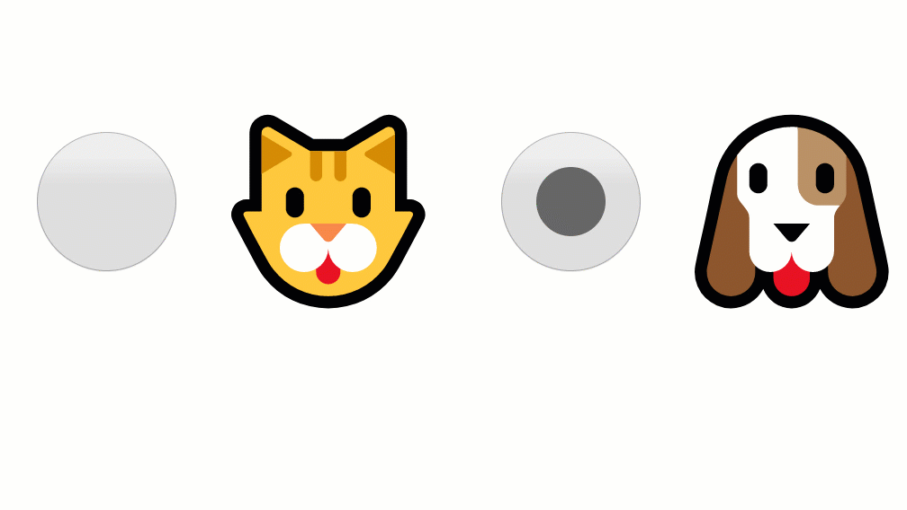

I love create my own components to know how they works, sometimes I install third party libraries, but when it is about to learn I simple start from scratch.

In this post you will learn about
1. create a custom radio button component
2. use the react context API
3.

## Radio Button Component
First lets create a function component that we will called `Button`, It will accept `checked`, `value`, `onChange` and its children as a props.

Then we are going to use our component, may be in a form we want to know if a user prefer a cat or dog as a pet, I know, this is a tough decision. 🤔

```javascript
import React from "react";

function Button({ checked, value, onChange, children }){
  return (
    <>
      <input
        type="radio"
        value={value}
        checked={checked}/>
        onChange={onChange}
      { children }
    </>
  )
}

function App() {
  const [pet, setPet] = React.useState("cat");
  function onChange({ target }) {
    setPet(target.value);
  }
  return (
    <div>
      <Button
      value="cat"
      checked={"cat" === pet}
      onChange={onChange}>
        <span role="img" aria-label="cat">
          🐱
        </span>
      </Button>
      <Button
      value="dog"
      checked={"dog" === pet}
      onChange={onChange}>
        <span role="img" aria-label="dog">
          🐶
        </span>
      </Button>
    </div>
  );
}
```
It works!



Now that we have our component working let improve it.
All radio button have the same logic, only one radio button can be checked at the same time.

Lets encapsulate the logic and take care of the state. To do it we are going to use `context` API.

The react docs describe the context API as a way to provide [data through the component tree without having to pass props down manually at every level.](https://reactjs.org/docs/context.html)


## React context
Now we need to take care of the state. Lets change the name of the function App to Radio and give to the state a more generic name.
1. Firts lets create a context: RadioContext,
2. Then change our Radio component to handle the state and will recieve as a prop: `children` and `onChange`.
3. finally in the return statement we will use `RadioContext.Provider` to allow other components to subscribe to the context changes.

```javascript
const RadioContext = React.createContext();

function Radio({ children }){
  const [state, setState] = React.useState("cat")
  function onChange({ target }){
    setState(target.value);
  }
  return (
    <RadioContext.Provider value={[state, onChange]}>
      <div
      role="radiogroup">
        {children}
      </div>
    </RadioContext.Provider>
  )
}
```

## Consuming state changes
Our components need a way to get the values provide by our context.

```javascript
function useRadioContext(){
  const context = React.useContext(RadioContext);
  if (!context) {
    throw new Error(
      `Radio compound components cannot be rendered outside the Radio component`
    );
  }
  return context;
}
```

## Susbcribe to change
Now we just need to subscribe to changes in our Button component

```javascript
function Button({ value, children }){
  const { state, onChange } = useRadioContext();
  const checked = value === state;
  return (
    <>
      <input
        type="radio"
        value={value}
        checked={checked}/>
      { children }
    </>
  )
}
```

So every time the state change the Button component will re render by using `useRadioContext()`