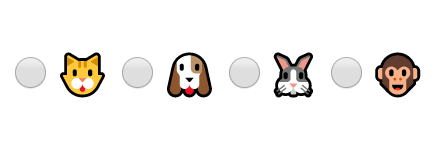
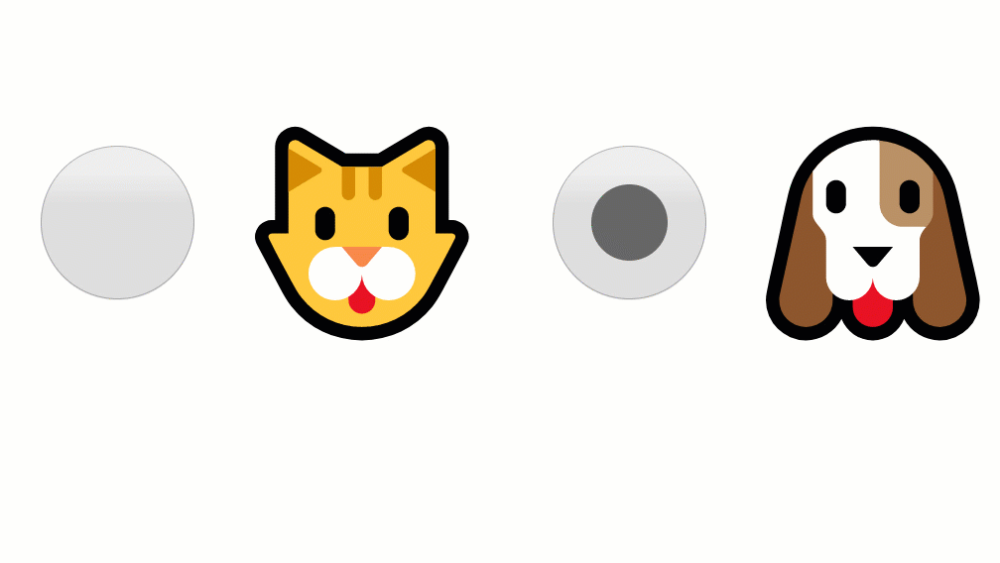

State management has been always a trend in the react community.

In this post, we are going to learn how to use **React Context** to create and provide a state to a group of components.

## A Basic Radio Button Component

First, let's create a Component that we will call **RadioButton**, it will receive **checked**, **value** and **onChange** as a prop. We want to encapsulate the **'input'** tag into a react component to make it reusable.

```jsx
import React from "react";

function RadioButton({ checked, value, onChange, children }){
  return (
    <label>
      <input
        type="radio"
        value={value}
        checked={checked}
        onChange={({ target }) => onChange(target.value)}
      />
      { children }
    </label>
  )
}
```

This component works as a **presentation component**, this is not a thing officially, but many people like to give this name to components that just do not have a local state and renders HTML.

Now we can use this component to display a group of inputs of **type="radio"**, for example of animals and just choose one.

```jsx
// in a return statement
<div>
  <RadioButton>🐱</RadioButton>
  <RadioButton>🐶</RadioButton>
  <RadioButton>🐮</RadioButton>
  <RadioButton>🐰</RadioButton>
  <RadioButton>🐵</RadioButton>
</div>
```



To select one of a group of options we need a state to hold the current value selected.

## Handle the state of our component

Let's create a stateful component in which we want to know if our users prefer a cat or a dog as a pet. I know, I know, this is a tough decision. 🤔

```jsx{numberLines: true}
  { /* highlight-range{2,4-6,14-16,22-24} */ }
function Form() {
  const [pet, setPet] = React.useState("cat");

  function handleOnChange(value) {
    setPet(value);
  }

  return (
    <div>
      <RadioButton
      value="cat"
      checked={"cat" === pet}
      onChange={onChange}>
        <span role="img" aria-label="cat">
          🐱
        </span>
      </RadioButton>
      <RadioButton
      value="dog"
      checked={"dog" === pet}
      onChange={onChange}>
        <span role="img" aria-label="dog">
          🐶
        </span>
      </RadioButton>
    </div>
  );
}
```
Before continuing, let's see what we did here.
First, we declare a stateful component called **Form**.
* at **line 2** we use `React.useState` with an initial value `"cat"`
* then at **line 4 to 6**, we declare a function `handleOnChange` that will update the state of the component

We can pass to our `<RadioButton/>` component whatever we want as a child, so we pass the `cat` and `dog` emojis with their appropriated tags.

```jsx
<RadioButton
  value="dog"
  checked={"dog" === pet}
  onChange={handleOnChange}>
  <span role="img" aria-label="dog">
    🐶
  </span>
</RadioButton>
```




## React context to share states through components

The logic behind a **radio button** is simple, it allows an user to choose only one of a group of options, in this case, an user only must choose between <span role="img" aria-label="cat">🐱</span> or <span role="img" aria-label="dog">🐶</span>.

We are going to use React Context to share the state through the Radio Button Components

First lets create a context `React.createContext()` and the return value will be assign to a const named `RadioContext`

```jsx
const RadioContext = React.createContext();
```

We are going to change the name of the stateful component from `Form` to `RadioGroup` and now it will recieve a new prop called `defaultValue` that would be our initial state and `children`

```git
- function Form()
+ function RadioGroup({ children, defaultValue = "" }){
  //...
}
```

We'll rename the old `pet` and `setPet` to more generic names like `state`, `setState` and the state will remain as an empty string.

```git
- const [pet, setPet] = React.useState("cat");
+ const [state, setState] = React.useState("");
```

Now that we are receiving a new prop `defaultValue` we need to add it to the state every time it changes.
We need to use `React.useEffect` for this.

```jsx
React.useEffect(()=>{
    setState(defaultValue)
  }, [defaultValue])
```

In the return statement, we will use `RadioContext.Provider` to allow other components to subscribe to the context changes, we will provide these values in `value={[state, onChange]}`

```jsx
<RadioContext.Provider value={[state, onChange]}>
  <div role="radiogroup">
    {children}
  </div>
</RadioContext.Provider>
```

Now let's move all of this to another file `radioButton.js`

```jsx
// radioButton.js
import React from "react";
const RadioContext = React.createContext();

function RadioGroup({ children, defaultValue }){
  const [state, setState] = React.useState("")

  React.useEffect(()=>{
    setState(defaultValue)
  }, [defaultValue])

  function handleOnChange(value){
    setState(value);
  }
  return (
    <RadioContext.Provider value={[state, handleOnChange]}>
      <div
      role="radiogroup">
        {children}
      </div>
    </RadioContext.Provider>
  )
}
```

## Consuming changes of states in the context.

Our components need a way to get the values provided by our context.
We are going to use `React.useContext` we'll passed the `RadioContext` created before as an input `React.useContext(RadioContext)`, this will return the values from the provider that we set on `<RadioContext.Provider value={[state, onChange]}>`

```jsx
function useRadioContext(){
  // we could use array destructuring if we want
  // const [state, onChange] = React.useContext(RadioContext);
  const context = React.useContext(RadioContext);
  if (!context) {
    throw new Error(
      `Radio compound components cannot be rendered outside the Radio component`
    );
  }
  return context;
}
```
Here we are only validating the `Button` component is used inside the `Radio` context component if not it will throw an error.

## Subscribe to changes

The Radio Button Component need to subscribe to changes in the `RadioGroup` Component.

```jsx
{ /* highlight-range{2-3} */ }
function RadioButton({ value, children }){
  const [state, onChange] = useRadioContext();
  const checked = value === state;
  return (
    <>
      <input
        type="radio"
        value={value}
        checked={checked}
        onChange={({ target }) => onChange(target.value)}
      />
      { children }
    </>
  )
}
```
then only need to tell if the component is **checked**, comparing the state (value) coming from the context and the `value` of the component`

let's see the code of the file complete.

```jsx
// radioButton.js
import React from "react";

const RadioContext = React.createContext();

function useRadioContext() {
  const context = React.useContext(RadioContext);
  if (!context) {
    throw new Error(
      `Radio compound components cannot be rendered outside the Radio component`
    );
  }
  return context;
}

function RadioGroup({ children, defaultValue, onChange }) {
  const [state, setState] = React.useState("");

  function handleOnChange(value) {
    setState(target.value);
    onChange(value);
  }

  React.useEffect(() => {
    setState(defaultValue);
  }, [defaultValue]);

  return (
    <RadioContext.Provider value={[state, handleOnChange]}>
      <div role="radiogroup">{children}</div>
    </RadioContext.Provider>
  );
}

function Button({ value, children }) {
  const [state, onChange] = useRadioContext();
  const checked = value === state;
  return (
    <label>
      <input value={value}
        checked={checked}
        type="radio"
        onChange={onChange} />
        { children }
    </label>
  );
}

Radio.Button = Button; // highlight-line

export default RadioGroup; // highlight-line
```

At the bottom of the file, we export the Radio component as a `default export` but before we added the `Button` component as a property of the Component.

## Using our custom component

```jsx
import React from "react";
import Radio from "./radioButton";

function App() {
  return (
    <RadioGroup defaultValue="cat" onChange={value => console.log("value: ", value)}>
      <RadioGroup.RadioButton value="cat">
        <span role="img" aria-label="cat">
          🐱
        </span>
      </RadioGroup.RadioButton>
      <RadioGroup.RadioButton value="dog">
        <span role="img" aria-label="dog">
          🐶
        </span>
      </RadioGroup.RadioButton>
    </RadioGroup>
  );
}
```
